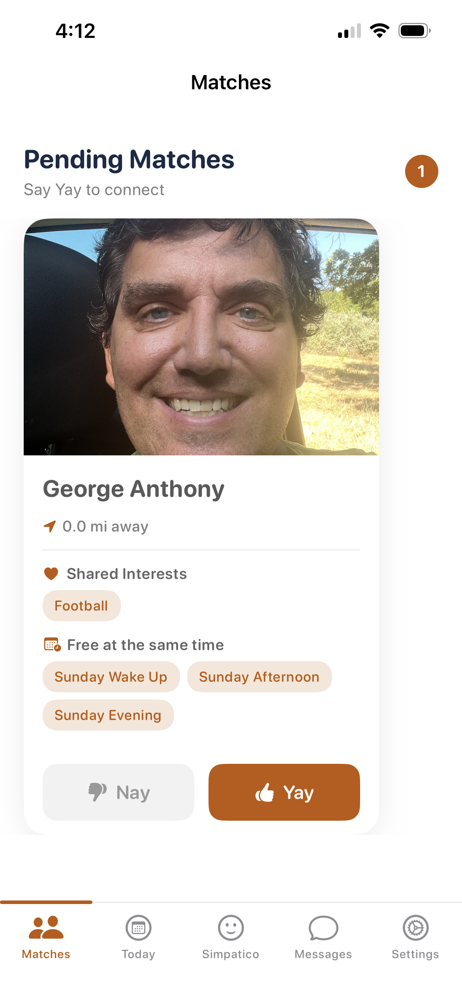
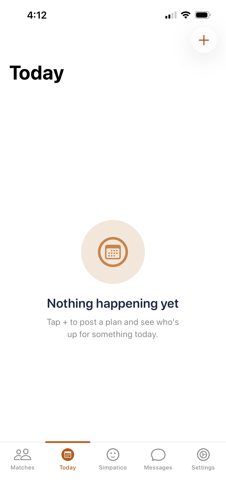
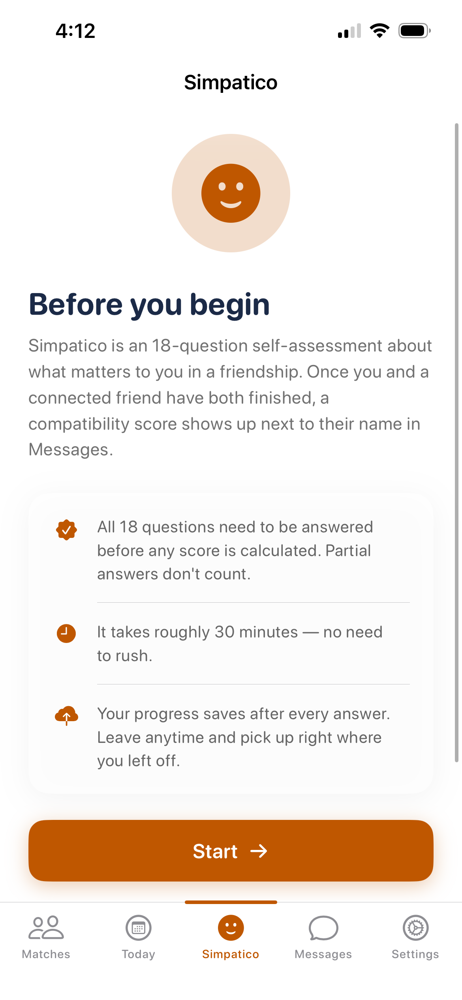
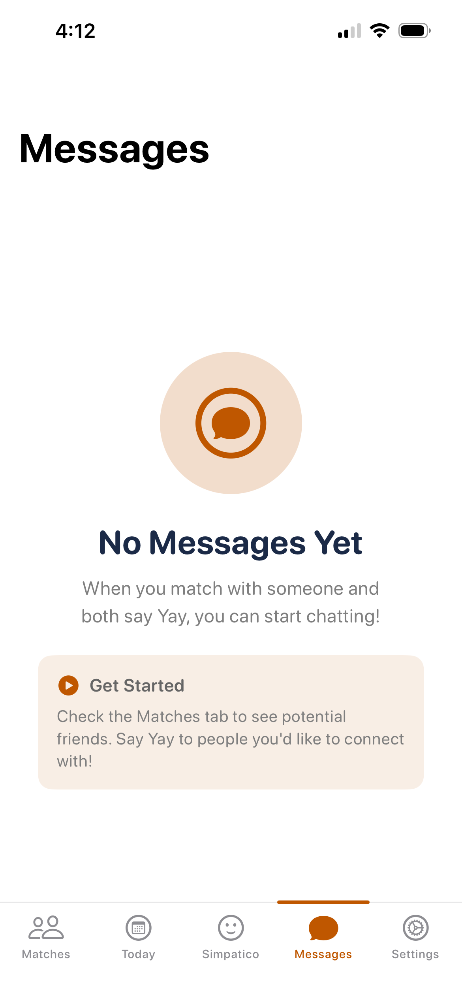
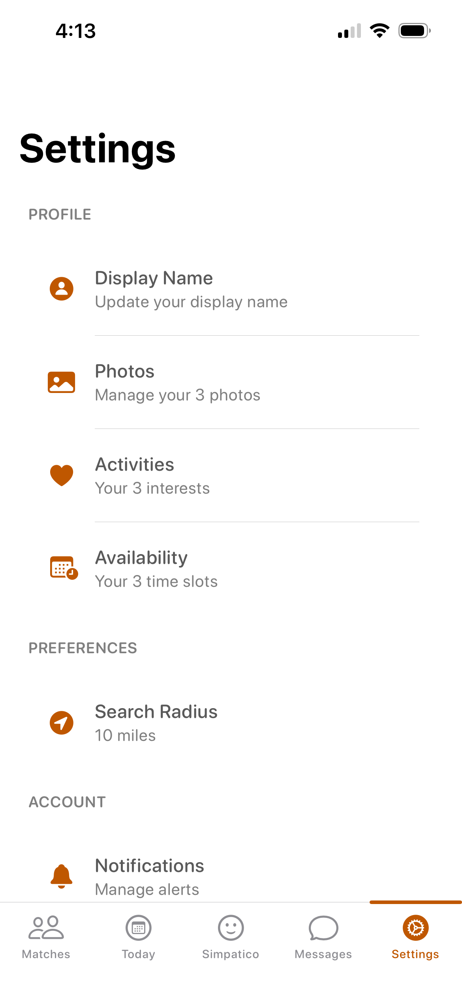

# ATX Friends

**A friendship app for Austin. Not dating. Not networking. Friends.**

Open source, AGPL-3.0, built solo since May 5, 2026.

---

## Why this exists

Hi there! Welcome to the ATX Friends repo. Thank you for visiting. 🙏

My name is George, and I'm a native Austinite. I've watched Austin change from a
close-knit series of down-home communities into a sprawling metro area where
we're all running around like chickens with our heads cut off. Part and parcel
of that transition: a lot of us have started to feel like we don't truly have
any friends.

Don't get me wrong. We have family and friends we value. We talk with them. We
get together and do fun things with them, occasionally. And yet — we feel
lonely, and we can't quite put our finger on why.

Here's the user this app is built for:

> *"I have friends. But those friends are either at different stages of life,
> or they're just too busy to hang out with me. So I want to use an app to make
> more friends who share my interests and my outlook on relationships — and use
> the app to actually go do those things with them."*

The loneliness epidemic is deeply entrenched in America now, and it hits younger
generations hardest. The cause, by and large, is simple: **not enough
face-to-face interaction.** Daily, weekly, monthly.

So everything in this app is built to produce one thing — two people, in the
same place, at the same time, doing something together.

---

## A look at it

| Matches | Today | Simpatico |
|:---:|:---:|:---:|
|  |  |  |
| *Only people who share an interest and a free slot* | *What's happening in the next 24 hours* | *18 questions, then a compatibility score* |

| Messages | Settings |
|:---:|:---:|
|  |  |
| *Every connection, nudged toward a real plan* | *Three photos, three interests, three time slots* |

---

## What it does

Five tabs. That's the whole app.

### 🤝 Matches

You'll only see people who share **at least one interest** and **at least one
free time slot** with you. No endless scroll of strangers.

- **Pending** — mutual "Yay" required. Both of you, or nothing.
- **Connected** — one tap to make an IRL Plan or open a conversation.

### 📆 Today

Something you're doing in the next 24 hours, posted openly.

Tap **+**, describe the plan, post it. Anyone can claim it — first come, first
served, one-on-one. Once claimed, it moves into Messages.

This is the "I'm getting tacos at 2, who's in" tab.

### 💬 Messages

Every conversation from Matches and Today lands here.

- Text back and forth, with a gentle nudge toward making an actual plan
- Proposed plans appear as an inline invitation in the thread
- Confirmed plans pin to the top of the conversation
- **Afterward, both people get a show-up poll** — thumbs up if the other person
  came, thumbs down if they didn't. That feeds a **Reliability** score, so
  flaking has a cost and showing up is worth something.

### 🧭 Simpatico

No friendship runs on shared activities alone. There has to be some simpatico.

An 18-question self-assessment about what actually matters to you in a
friendship. Once two connected people both finish it, a compatibility score
appears next to their name in Messages. Question format is styled after the old
OkCupid questionnaire, which was genuinely good at this.

### ⚙️ Settings

- **Profile** — display name, 3 photos, 3 activities, 3 time slots
- **Preferences** — search radius
- **Account** — notifications, privacy & safety (blocking, reporting, your
  data), location access, sign out

---

## Status

**Alpha.** First real (non-developer) users came on board September 20, 2026.
Not on the App Store. Expect rough edges — that's what the Issues tab is for.

Signup is currently geofenced to **within 50 miles of Austin, TX**. If you fork
this for your own city, that's the first thing you'll change (see Setup, step 7).

---

## Built with

| Layer | What |
|---|---|
| App | Swift / SwiftUI, iOS |
| Auth | Firebase Auth — email, Sign in with Apple, Google Sign-In |
| Database | Cloud Firestore |
| Backend | Firebase Cloud Functions |
| Calendar | Apple EventKit, Google Calendar API, Microsoft Graph API |
| Dependencies | Swift Package Manager (GoogleSignIn-iOS, MSAL, Firebase SDK) |

---

## Setup guide

Getting this running takes about an hour, most of which is Firebase
configuration rather than code. Work through it in order.

### What you need first

- A Mac with **Xcode** installed
- **Node.js 20+** and the Firebase CLI (`npm install -g firebase-tools`)
- A **Google account** (for Firebase)
- An **Apple Developer account** — the free tier works, but apps installed with
  it expire after 7 days and need the phone plugged back in. The paid tier
  ($99/yr) is worth it the moment you have testers you won't see every week.
- A **physical iPhone**. The Simulator can't do location, and location is load-bearing here.

### 1. Clone it

```bash
git clone https://github.com/YOUR-USERNAME/ATX-Friends.git
cd ATX-Friends
```

### 2. Make your own Firebase project

Go to [console.firebase.google.com](https://console.firebase.google.com) and
create a project. Then, inside it:

**Authentication** → Get started → enable:
- Email/Password
- Apple
- Google

**Firestore Database** → Create database → start in **production mode**
(the security rules in this repo will replace the defaults in step 5).

**Upgrade to the Blaze plan.** Cloud Functions requires it. It's
pay-as-you-go, and a small app typically stays inside the free monthly
allowance — but you do have to put a card on file. There's no way around this
if you want the backend to work.

### 3. Register the iOS app in Firebase

In your Firebase project → Project Settings → Your apps → **Add app → iOS**.

Use your own bundle identifier — something like `com.yourname.YourAppName`. Do
**not** reuse mine.

Download the `GoogleService-Info.plist` it gives you and drop it into the Xcode
project (same folder as `Info.plist`). Make sure "Copy items if needed" is
checked and it's added to the app target.

> ⚠️ **This file is gitignored, and should stay that way.** It points at your
> Firebase project. Don't commit it.

### 4. Wire up the URL schemes

Open your `GoogleService-Info.plist` and copy the `REVERSED_CLIENT_ID` value.

In Xcode → your target → **Info** → **URL Types**, add it as a URL Scheme. This
is what lets Google Sign-In return to your app after authenticating.

If you also want Outlook calendar support (step 8), add a second URL scheme:
`msauth.YOUR.BUNDLE.ID`

### 5. Deploy the backend

```bash
firebase login
firebase use --add          # pick the project you made in step 2
firebase deploy --only firestore:rules,functions
```

Double-check that `firebase use` is pointed at *your* project before you deploy
anything. Deploying to the wrong project is an easy and unpleasant mistake.

### 6. Build and run

Open the `.xcodeproj` in Xcode, pick your physical iPhone as the destination,
set your own signing team under Signing & Capabilities, and hit Run.

You'll need to trust the developer certificate on the phone the first time:
Settings → General → VPN & Device Management.

### 7. 📍 Point it at your city

**This is the important one if you're forking.**

Signup is gated to a 50-mile radius around Austin. Search the codebase for the
Austin coordinates (30.2672, -97.7431) and replace them with your city's. Change
the radius too if your metro is a different shape.

While you're in there, change the app's name and display strings. Please don't
ship another "ATX Friends" — see [ETHOS.md](./ETHOS.md) and the note on the name
below.

### 8. Calendar integrations (optional)

The app can write confirmed plans to a user's calendar. Apple Calendar works out
of the box via EventKit. The other two need accounts:

**Google Calendar**
1. [Google Cloud Console](https://console.cloud.google.com) → the project Firebase created for you
2. APIs & Services → Library → enable **Google Calendar API**
3. OAuth consent screen → Data Access → add the `calendar.events` scope
4. OAuth consent screen → Audience → add your test accounts

You don't need Google's verification review until you go live beyond your test
list. Plan for that review to take a while when you get there.

**Microsoft / Outlook Calendar**
1. [Azure Portal](https://portal.azure.com) → App registrations → New registration
2. Supported account types: organizational **and** personal Microsoft accounts
3. Add the `Calendars.ReadWrite` delegated Microsoft Graph permission
4. Register it as a **public/native client** — no client secret
5. Redirect URI: `msauth.YOUR.BUNDLE.ID://auth`
6. Put the Application (client) ID into the app's Microsoft config

### 9. Running the tests

Firestore rules and Cloud Functions have emulator tests:

```bash
firebase emulators:exec --only firestore,functions "npm test"
```

---

## Project structure

```
ATX-Friends/
├── ATX Friends.xcodeproj
├── ATX Friends/              # SwiftUI app
├── functions/                # Firebase Cloud Functions
├── firestore.rules           # Firestore security rules
├── firestore.indexes.json
├── README.md
├── LICENSE
├── COPYING.EXCEPTION
└── ETHOS.md
```

---

## Contributing

**Start here:** [open issues](../../issues). Anything tagged
[`good first issue`](../../labels/good%20first%20issue) is a reasonable place
to jump in cold.

Bug reports are just as welcome as code. If something broke, tell me what you
did, what you expected, and what happened instead — that's enough.

**Two requests:**

1. By submitting a contribution, you agree it's licensed under AGPL-3.0 and you
   grant the same additional permission described in
   [COPYING.EXCEPTION](./COPYING.EXCEPTION).

2. Please don't put trust-and-safety heuristics or anti-abuse thresholds in a
   public pull request — email me instead. Publishing the exact rules that catch
   bad actors mostly just teaches bad actors the rules.

---

## Contact

- **Bugs, features, code** → [open an issue](../../issues)
- **Anything else** → gap512@protonmail.com ; (512) 655-3940

I'm a solo developer with a day job, so I'm not always fast. I do read
everything.

---

## License

ATX Friends is licensed under the **GNU Affero General Public License v3.0**
([full text](./LICENSE)), with one additional permission for app store
distribution ([COPYING.EXCEPTION](./COPYING.EXCEPTION)).

In plain English:

- **You can** use this code, change it, and launch your own version in your own city.
- **You can** ship it on the App Store and Google Play. The exception exists specifically so you can.
- **You must** publish your source code — including if you only ever run it as a hosted service. That's the "Affero" part, and it's deliberate.

If you want to use it under different terms, ask me. I'm reachable and I'm not
difficult.

## The name

The code is open. The name isn't.

"ATX Friends" stays with this project. If you launch your own version, give it
your own name — ideally one that says where you are. Boston Buddies. Portland
Pals. Whatever fits your city.

This isn't me guarding a brand. It's so that when someone downloads a thing
called ATX Friends, they know whose thing it is, and so the good and bad
reputations of ten different cities' apps don't get pooled into one.

## What I ask of you

The license covers what you're legally required to do. It can't cover what this
project is *for*.

There are three things I'm asking of anyone who builds on this — keep it local,
don't make it a subscription, keep your code open — plus the one test I think
every feature should have to pass.

**None of it is binding. All of it is the reason this repo exists.**

→ **[Read ETHOS.md](./ETHOS.md)**

It's a two-minute read. If you're going to take this code and build something
with it, I'd count it a kindness if you took the two minutes.

---

*Built in Austin, Texas. Go make a friend.*
